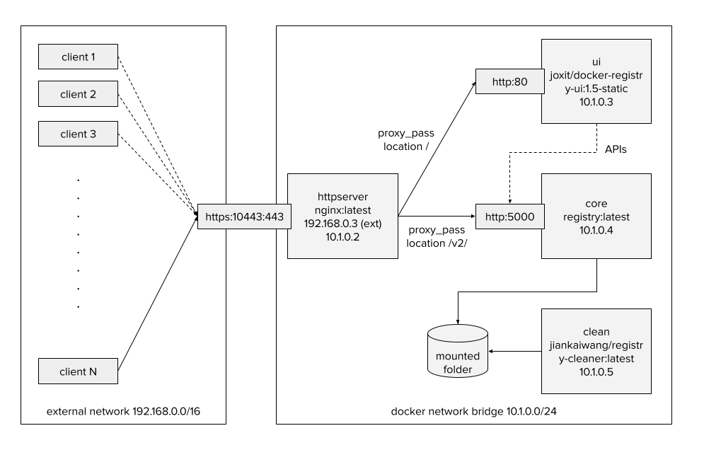

# Image Registry

## Architecture

The architecture is composed of four containers connected by `docker compose`.



## How to use

Start the image registry service.

```sh
# git clone the service
git clone https://github.com/jiankaiwang/image-registry.git
cd ./image-registry

# edit the bootstrap script to set the variables
# bootstrap the necessary components
vim ./bootstrap.sh
bash ./bootstrap.sh

# start the image registry service
vim ./make.sh
bash ./make.sh start

# stop and delete the service
bash ./make.sh stop
```

[**OPTIONAL**] Before starting the service, you have to prepare the htpasswd.

```sh
cd ./secrets

vim ./generate_accpwd.sh
bash ./generate_accpwd.sh
```

For clients, use the script to use set the environment.

```sh
# for mac user
bash ./mac.sh help
bash ./mac.sh add nginx.cert

# for linux user
bash ./ubuntu.sh help
bash ./ubuntu.sh add nginx.cert
```